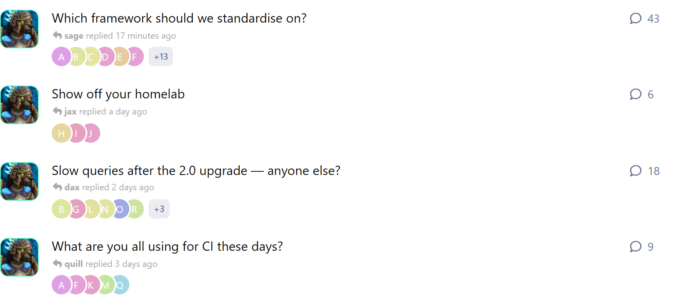
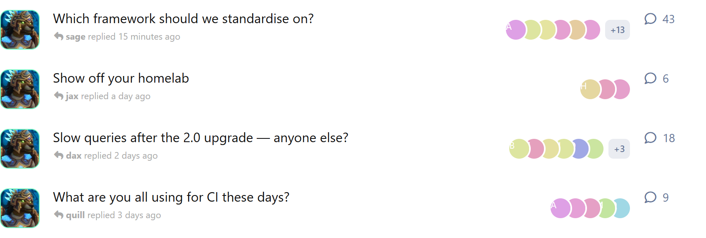
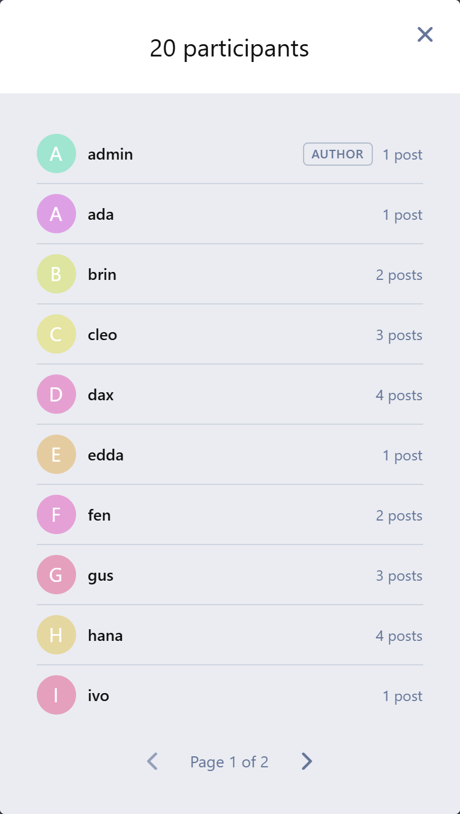
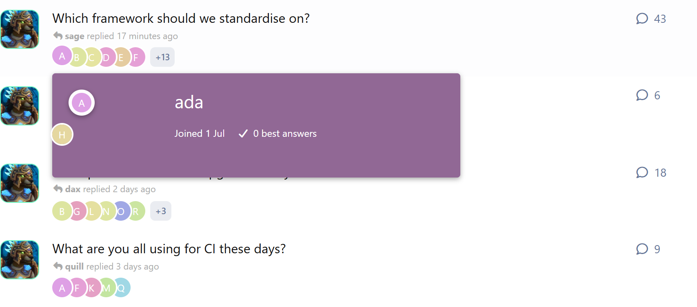
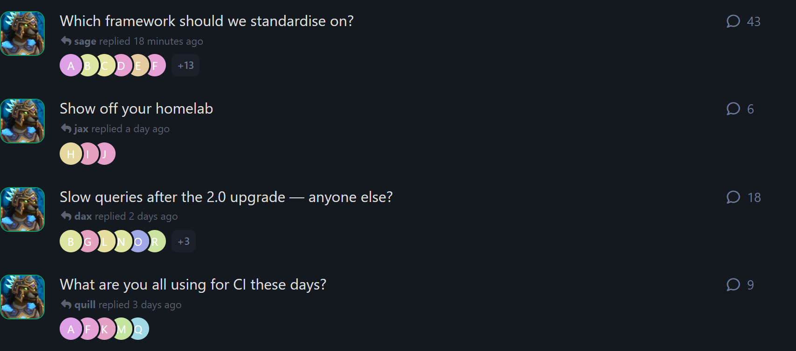

# Discussion Participants

Shows the avatars of everyone who has posted in a discussion, right in the
discussion list, so people can see who is in a thread before they open it.
Anyone the strip has no room for is counted on a badge that opens the full,
paginated participant list.

Built for **Flarum 2**.



```bash
composer require ernestdefoe/discussion-participants
```

Existing forums need a one-time backfill — discussions that predate the
extension have no participant data until it is built:

```bash
php flarum participants:populate
```

There is a **Recalculate** button on the extension's settings page that does
the same job in the browser, for anyone without shell access.

## What it does

**An avatar strip on every discussion row**, on its own line under the title by
default — or inline beside the reply count, if you would rather rows stayed one
line tall.



**An overflow badge** counting the participants the strip has no room for.
Clicking it opens the full roster, ten per page, with each person's post count
in that discussion and a link to their profile.



**Profile cards on hover** — the same card Flarum shows on post authors, on the
same timing.



**It follows the reader's theme**, light or dark, and mirrors correctly under
right-to-left languages.



And it stays honest as the discussion moves:

- **Live.** A first-time replier's avatar appears without a refresh, and the
  counts move with it.
- **Moderation-aware.** Hiding, restoring and deleting a post all update the
  strip and the counts.

## Settings

| Setting | Default | What it does |
| --- | --- | --- |
| Where to show them | Under the title | Under the title on its own line, or inline beside the reply count. |
| Avatars shown | 6 | How many avatars before the rest become an overflow badge. Up to 12. |
| Avatar size | Medium | Small (20px), medium (24px) or large (32px). |
| Order | Who posted first | Who posted first, who posted most, or who posted most recently. |
| The person who started the discussion | Never show them | Their avatar is already in the author column, so the strip leaves them out. Can also show them only if they replied as well, or always show them first. |
| Minimum participants | 1 | Discussions with fewer repliers get no strip, which keeps quiet lists clean. |
| Show the overflow badge | On | |
| Show a profile card on hover | On | |
| Limit to tags | All tags | Needs `flarum/tags`. Hidden entirely without it. |

## Notes on how it works

**It does not touch `discussions.participants_count`.** That column belongs to
Flarum core. This extension keeps its own `discussion_participants` table and
a small `discussion_participant_meta` table, and drops only those two on
uninstall.

**The discussion list stays at a fixed query count.** Participants are a real
Eloquent relation, eager loaded across the whole page with a per-discussion
limit, so a page of twenty discussions costs two extra queries rather than
twenty. Serving them as genuine `users` resources also means the same person
appearing in ten discussions is sent once, and core's own avatar and profile
card components render them untouched.

**The overflow badge counts repliers, not participants.** Whoever started the
discussion already has their avatar on the row in core's author column, so
counting them as hidden would overstate the badge by one on nearly every
discussion.

## Compatibility

- Flarum `^2.0`
- PHP `^8.3`
- MySQL 8.0+ / MariaDB 10.6+ (the per-discussion limit uses a window function)
- Optional: `flarum/tags` for the tag filter

## Licence

MIT
